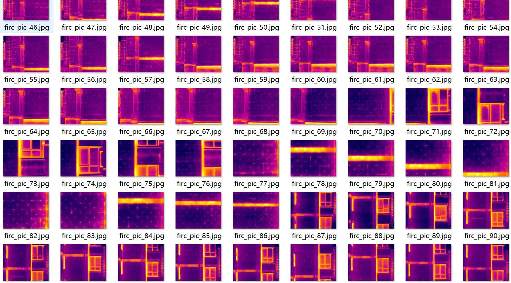
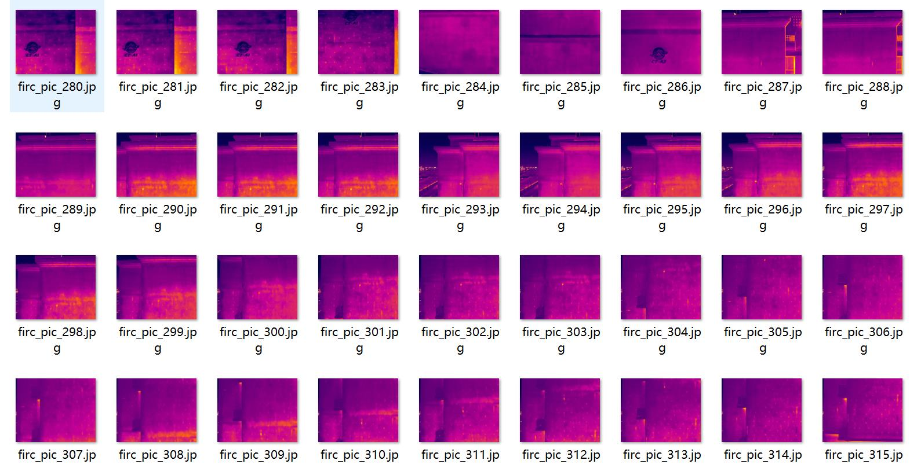
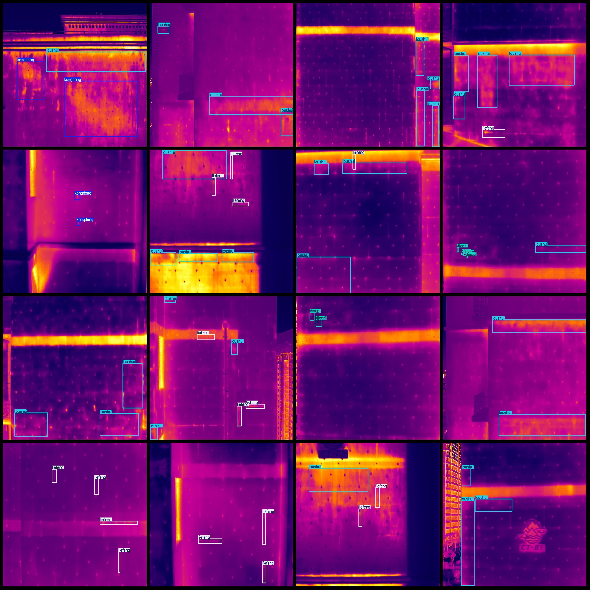
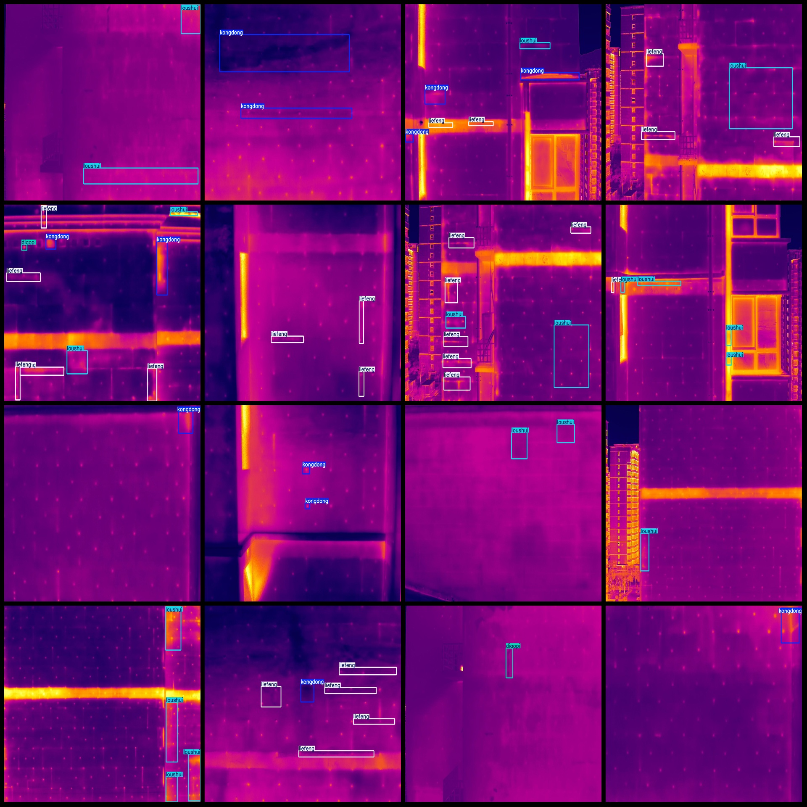

# Infrared Thermal Imaging Building Wall Defects Cracking, Surface Peeling, Holes, Water Leakage Detection Dataset VOC+YOLO Format 463 Categories

Dataset Format: Pascal VOC format + YOLO format (txt file without segmentation path, only containing jpg images and corresponding VOC format xml files and yolo format txt files)
Number of Images (jpg file count): 463
Number of Annotations (xml file count): 463
Number of Annotations (txt file count): 463
Number of Label Categories: 4
Label Category Names (note that the order of labels in the yolo format is not consistent with this, but is based on the "labels" folder's "classes.txt" file): ["diaopi", "kongdong", "liefeng", 
"loushui"]
Number of Boxes per Category:
- Diaopi (Surface Peeling) = 46
- Kongdong (Holes) = 196
- Liefeng (Cracks) = 798
- Loushui (Water Leaks) = 493
Total Boxes: 1533
Number of Images per Category:
- Diaopi (Surface Peeling) = 24
- Kongdong (Holes) = 117
- Liefeng (Cracks) = 256
- Loushui (Water Leakage) = 251
Image Resolution: 1280x1024
Annotation Tool: labelImg
Annotation Rules: Draw boxes around categories
Important Notice: The dataset does not have been divided into training, validation, or test sets; it requires self-division.
Special Remark: This dataset does not guarantee any accuracy of the trained model or weight files.
Image Preview:
Annotation Example:

Image

Here is a pay link on Stripe ( https://buy.stripe.com/3cs8yP7sY87d0vu9AB ). Please contact me lonlonago@foxmail.com after funding $89, and I will send you a complete data files , thank you!

